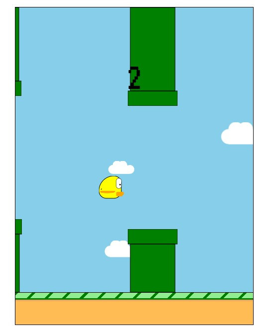

# Floppy-Birb

A copy of popular mobile game Flappy Bird.

## Table of contents

- [Overview](#overview)
  - [The features](#the-features)
  - [Screenshot](#screenshot)
  - [Links](#links)
- [My process](#my-process)
  - [Built with](#built-with)
- [Author](#author)

## Overview

### The features

- Collision detection
- Score count
- Highscore storage in local storage
- Randomly generated height of the towers
- Background clouds generated dynamically

### Screenshot

### Links

- Solution URL: [Floppy Birb](https://vilmis04.github.io/Floppy-Birb/)

## My process

### Built with

- HTML
- CSS
- JavaScript

## Author

- Github - [vilmis04](https://github.com/vilmis04)
- LinkedIn - [Vilmantas Sudaris](https://www.linkedin.com/in/vilmantas-sudaris-63567586)
